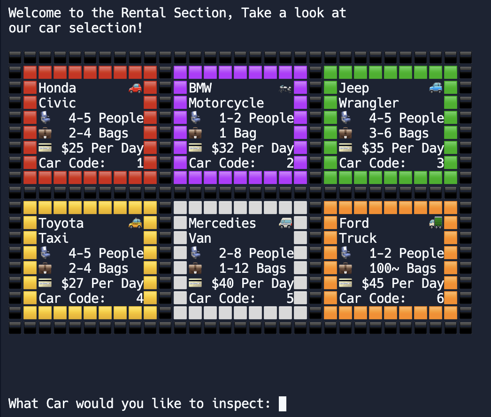
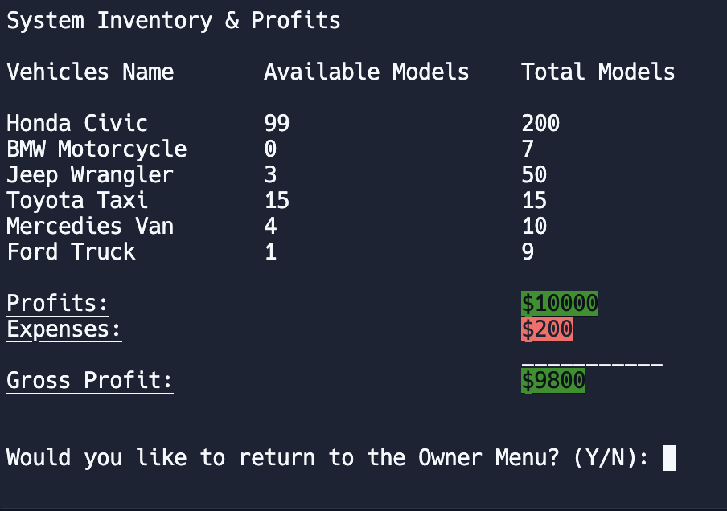
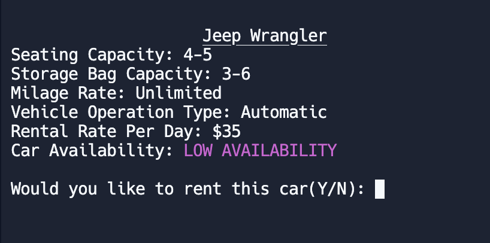
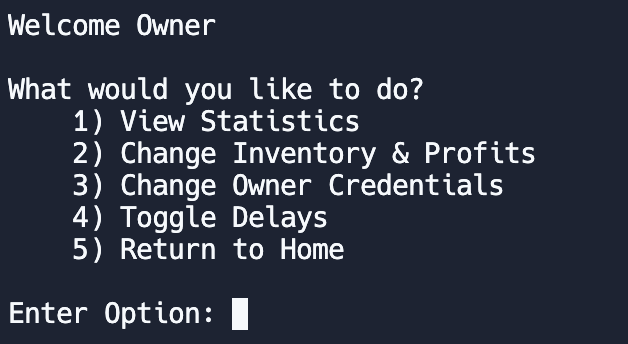

# C++ Car Rental System

The Car Rental System is a command-line application designed to facilitate the rental and return of vehicles for customers and provide administrative functions for the owner of the rental service.

## What The User Can Do

- **Viewing Available Vehicles:** Users can easily browse through the available vehicles within the system. Each vehicle listing provides essential details such as seating capacity, storage bag capacity, and the rental price per day. 
- **Managing Inventory and Real-World Data:** Renting a vehicle is a seamless process within the system. Users can select their desired vehicle and proceed to provide personal and payment information, including debit/credit card details. Upon confirmation, users receive a receipt confirming the rental transaction.
- **Returning Vehicles and Online Payment:** Users can access the return section, where they provide necessary details such as the rental duration and payment information. Upon confirmation of the return, users can conveniently pay online using a debit/credit card for the rental charges.
- **Accessing Extra Help:** For additional assistance or inquiries, users can access the help section of the system.

## What The Owner Can Do

- **Viewing Financial Metrics and Inventory Status:** As the owner, you have access to financial metrics like renting revenue, expenses, and gross profits, along with real-time inventory status. 
- **Managing Inventory and Real-World Data:** Owners can update inventory details to reflect real-world changes accurately. This involves adjusting vehicle availability, updating pricing based on market trends, and managing vehicle models. 
- **Account Details Modification:** Owners can easily modify account information for accuracy and security. 
- **Customization of Rental System Display:** Owners can customize the display features of the rental system to enhance the user experience and meet business requirements.

## Requirements

To run the Car Rental System, you need:

C++ compiler
Standard C++ library
GNU Compiler Collection (GCC)

## Screenshots

   
   
   
   

## Usage

To use the car rental system, you can clone the git repository or access the replit link: https://replit.com/join/gtxxptqgde-aryanpatel0705

## License

This project is licensed under the MIT License. See the [LICENSE](LICENSE) file for more details.

## Contact Information

For questions or support, please contact me at:

- **Email:** [a236pate@uwaterloo.ca](mailto:a236pate@uwaterloo.ca)
- **LinkedIn:** [linkedin.com/in/aryanpatel05](https://linkedin.com/in/aryanpatel05)
